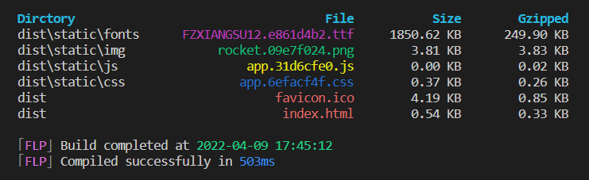

<div align="center">
  <h1>Friendly Log Webpack Plugin</h1>
  <p>Plugin that provides optimized terminal output.</p>
</div>

<div align="center">
  <br />
  
  <p>Development</p>
</div>

<div align="center">
  <br />
  
  <p>Production</p>
</div>

## Install

```bash
# NPM
  npm install --save-dev friendly-log-webpack-plugin

# Yarn
  yarn add --dev friendly-log-webpack-plugin
```

## Options

You can pass a hash of configuration options to friendly-log-webpack-plugin. Allowed values are as follows:

|     Name     |  Type   |               Default                | Description                |
| :----------: | :-----: | :----------------------------------: | :------------------------- |
|   disabled   | Boolean |                false                 | 是否禁用                   |
|     open     | Boolean |                false                 | 编译完成是否自动打开浏览器 |
| countControl | Object  | { css: 0, js: 0, img: 20, font: 20 } | 不同类型文件显示数量控制   |

## Usage

Just add the plugin to your webpack config as follows:

**webpack.config.js**

```js
const FriendlyLogPlugin = require('friendly-log-webpack-plugin')

module.exports = {
  // only display errors and warnings
  stats: {
    preset: 'none',
    errors: true,
    warnings: true,
  },
  // webpack-dev-server only display errors and warnings
  infrastructureLogging: {
    level: 'warn',
  },
  plugins: [new FriendlyLogPlugin()],
}
```
